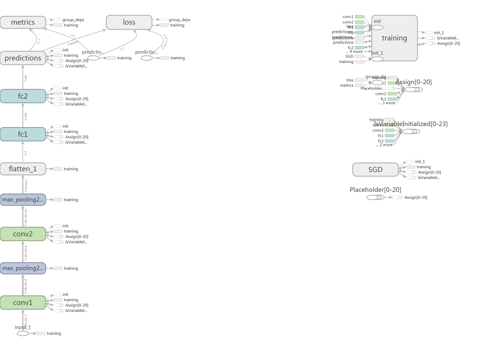
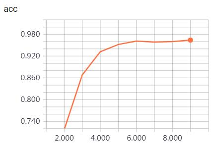
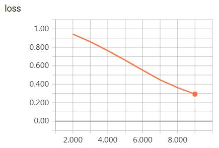
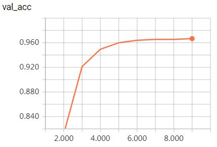
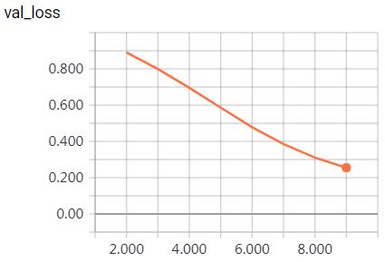
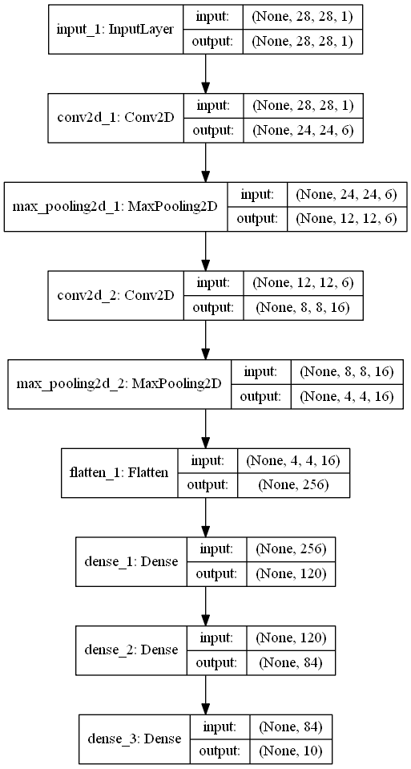
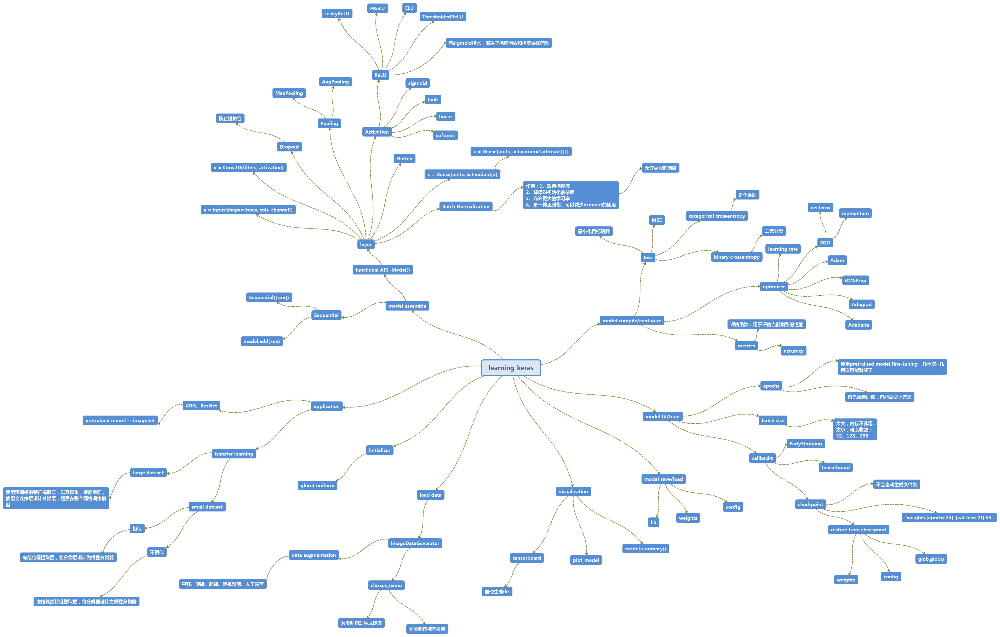

将keras、tensorflow、caffe都学了一遍，每种框架都有各自适合的应用场景，其中keras最简单易学。本文将介绍如何使用keras训练深度学习模型。

# 一、读取数据
## （1）数据准备
本文使用手写体数字识别数据库mnist。keras通过mnist.load_data()即可读取训练样本和测试样本，将读取数据的细节隐藏了。为了说明keras如何读取自己采集的数据，我为mnist的10个label建立对应名称的子文件夹[0 1 2 3 4 5 6 7 8 9]，并将mnist的图像归一化为32x32保存到对应文件夹中。文件夹目录结构为：  
mnist.32x32/train/[0 1 2 3 4 5 6 7 8 9]  
mnist.32x32/test/[0 1 2 3 4 5 6 7 8 9]			  
## （2）数据读取与数据增强
keras提供了ImageDataGenerator类实现数据读取和数据增强。使用generator的方法读取数据的好处是节省计算机资源，因为数据量很大时可能无法一次性将数据全部读入。主要的数据增强方法：平移、翻转、旋转、随机裁剪、人工噪声。  
数据读取代码如下：  
    
    from keras.preprocessing.image import ImageDataGenerator  
    def load_mnist_data_from_directory_generator(dirpath, target_size = (256, 256), batch_size=32, color_mode='rgb', class_mode='categorical', classes=None):  
        train_datagen = ImageDataGenerator(rescale=1 / 255.0)  
        test_datagen = ImageDataGenerator(rescale=1 / 255.0)
        train_generator = train_datagen.flow_from_directory(
            '{0}/train'.format(dirpath),
            target_size=target_size,
            batch_size=batch_size,
            class_mode=class_mode,
            color_mode=color_mode,
            classes=classes)

        test_generator = test_datagen.flow_from_directory(
            '{0}/test'.format(dirpath),
            target_size=target_size,
            batch_size=batch_size,
            class_mode=class_mode,
            color_mode=color_mode,
            classes=classes)
        return train_generator, test_generator

	
# 二、模型设计  
这里以LeNet为例，采用函数式API设计模型。
	
	def LeNet(input_shape, num_classes):
        inputs = Input(input_shape, name='input_1')
        x = Conv2D(6, (5, 5), activation='relu', name='conv1')(inputs)
        x = MaxPool2D((2, 2), name='max_pooling2d_1')(x)
        x = Conv2D(16, (5, 5), activation='relu', name='conv2')(x)
        x = MaxPool2D((2, 2), name='max_pooling2d_2')(x)
        x = Flatten(name='flatten_1')(x)
        x = Dense(120, activation='relu', name='fc1')(x)
        x = Dense(84, activation='relu', name='fc2')(x)
        predictions = Dense(num_classes, activation='softmax', name='predictions')(x)
        model =  Model(inputs=inputs, outputs=predictions)
        return model
	
# 三、模型编译  
需要指定优化器、损失函数、评估函数。

	model = LeNet(input_shape, num_classes)
    optimizer = optimizers.SGD(lr=0.01)
    model.compile(optimizer=optimizer, loss='categorical_crossentropy', metrics=['accuracy'])
	
# 四、模型训练
此处需要指定epochs。batch_size在flow_from_directory中指定。通过TensorBoard实现可视化。通过ModelCheckpoint实现检查点的保存，用于恢复中断的模型训练。
	
	tensorboard = keras.callbacks.TensorBoard(log_dir=log_dir)
    checkpointer = keras.callbacks.ModelCheckpoint(filepath=ckpt_filepath)

    history = model.fit_generator(generator=train_generator,
                        steps_per_epoch=len(train_generator),
                        epochs=epochs,
                        verbose=1,
                        callbacks=[tensorboard, checkpointer],
                        validation_data=test_generator,
                        validation_steps=len(test_generator),
                        initial_epoch=initial_epoch)
	
tensorboard可视化结果：  
*graphs*:

  
*scalars*:  

  
  
  

# 五、模型评估
评估模型的性能

	score_evaluate = model.evaluate_generator(generator=test_generator, steps=len(test_generator))
    print(score_evaluate)
						
# 六、模型保存与导入
	model.save(model_name)
	model =  keras.models.load_model(model_name)
	
# 七、其他技巧
## （1）从checkpoint恢复中断的模型训练
假设模型保存为ckpt_filepath = ckpt_dir + '/weights.{epoch:02d}-{val_loss:.2f}.h5'，恢复中断的模型训练：

	ckpt_filelist = glob.glob('{0}/weights.*.h5'.format(ckpt_dir))
    if len(ckpt_filelist) == 0:
        model = mnist_lenet(input_shape, num_classes)
    else:
        filename = ckpt_filelist[-1]
        model = keras.models.load_model(filepath=filename)
        initial_epoch = int(filename.split('weights.')[-1].split('-')[0])
        print('restore from {0}, initial_epoch = {1}'.format(filename, initial_epoch))
        
## （2）模型可视化
除了用tensorboard，还可以使用model.summary()和plot_model。  	
*plot_model结果*：

# 八、learning_keras思维导图
	
	    
	